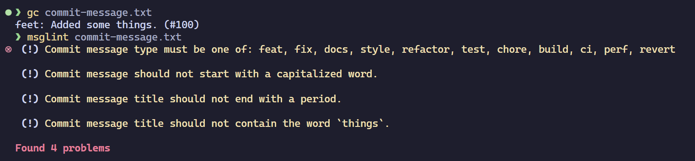

# msglint

Checks your commit messages.



## Installation

### Install from source

```shell
git clone https://github.com/aspizu/msglint
cd msglint
cargo install --path .
```

### Instal from source (using cargo)

```shell
cargo install --git https://github.com/aspizu/msglint
```

## Usage

### Install the git hook into your repository

> [!NOTE] 
> You will have to do this for every repository.

```shell
msglint --install
```

### Test a commit message from a file

```shell
msglint commit-message.txt
```

### Uninstall the git hook from a repository

```shell
rm .git/hooks/commit-msg
```
